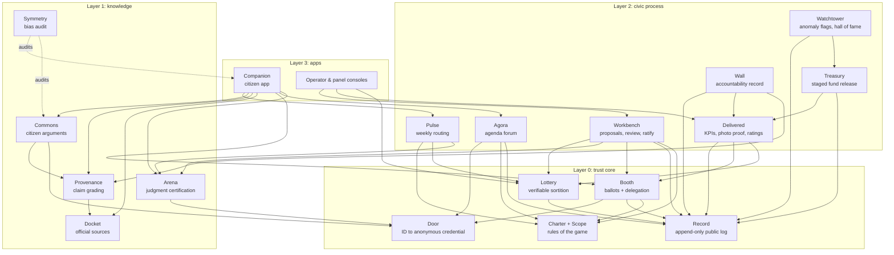
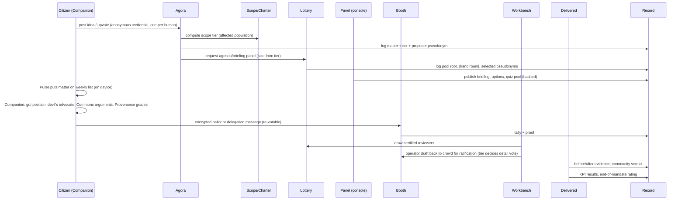

# Democracy2.0: technical architecture (v0, 2026-10-05)

Sources: Notion "Democracy 2.0 — Design Notes" and "The Civic Companion — Standalone Product (v1)" (both read 2026-10-05), and `/mnt/project-files/brainstorm/01..03`. Where the two disagree, the newer Notion section wins and the conflict is listed in [§9](#9-conflicts-found-between-sources).

Companion files:
- [01-modules.md](01-modules.md): one spec per module (purpose, standalone value, API, data, dependencies, licence, revenue, acceptance criteria).
- [02-protocols.md](02-protocols.md): the cryptography and trust protocols (identity, ballots, delegation, ledger, sortition, escrow).
- [03-data-model.md](03-data-model.md): shared entities and the contract each module publishes.

---

## 1. Design rules the architecture enforces

These come straight from the design notes and are turned into hard technical constraints.

| Design rule (Notion) | Technical constraint |
|---|---|
| Design for bad actors; trust by architecture | No module may require trusting its operator for integrity. Every fact the public relies on is written to **Record** and independently verifiable. |
| The system holds no opinion (a pipe, not a voice) | No ranking, routing or generation logic is hidden. Every ranking algorithm, prompt, model version and Charter parameter is versioned and logged. |
| Power transparent, participation private | Voters exist only as unlinkable pseudonyms. Anyone holding delegated power, a public role or public money is a named public actor. |
| Operators can never touch the rules of the game | **Charter** changes are accepted by Record only when co-signed by a Booth tally proof from a constitution-class vote. No operator key can sign one. |
| One dial: scope | One shared **Scope** library computes the tier of every matter. Priority, who drafts details, review size, verification method and pay all read that tier from Charter. |
| Open source + self-hostable is the ultimate safeguard | Every module ships as an OCI image with reproducible builds and a one-command self-host. Held modules are source-escrowed from day one (see [02-protocols.md §6](02-protocols.md#6-source-escrow-the-dead-mans-switch)). |
| Never a chore | The weekly list is short by construction (vote budget + delegation default). Routing runs on the citizen's device. |
| Device access deferred, last mile must stay possible | Protocols are client-agnostic (a kiosk or assisted client can be added later). No protocol assumes a high-end phone or constant connectivity. |

## 2. System map

Four layers. Each box is a separately buildable module with its own licence and its own API. Arrows mean "calls" or "reads from". No module reaches into another's database.



## 3. Module catalogue: what is sold, what is published

Three ways a module leaves the building:
- **Publish now**: open source immediately. Used where the module only has value if people can verify it, or where spreading it helps the mission.
- **Hold (escrowed)**: closed for now, source escrowed and released on trigger (the dead man's switch).
- **Sell**: there is a paying customer for the module on its own.

A module can be both published and sold (open core or hosted service).

| # | Module | What it is on its own | Licence | Revenue | Phase |
|---|---|---|---|---|---|
| 1 | **Companion** | Consumer app: explains bills and local decisions, devil's advocate, argument library, "voice your mind" | Hold | Freemium subscription; licences for schools and newsrooms | 1 |
| 2 | **Docket** | Normalized feed of bills, council decisions and budgets (Luxembourg first) | Publish (Apache-2.0), data CC BY | Paid API with SLA | 1 |
| 3 | **Commons** | Library of real citizen arguments per matter, clustered and ranked by bridging | Publish (AGPL-3.0), data CC BY-SA | None directly; feeds Companion | 1 |
| 4 | **Provenance** | Claim grader: 🟢/🟡/🔴 with citations to open records | Open core (AGPL engine, hosted API sold) | API for newsrooms, fact-checkers, platforms | 1 |
| 5 | **Symmetry** | Harness that measures whether an AI pushes back equally hard in every direction | Publish (Apache-2.0) | Paid audit reports for other AI vendors and public bodies | 1 |
| 6 | **Door** | Verify a person once with state ID, issue an unlinkable anonymous credential | Publish (AGPL-3.0) | Hosted "one human, one account, anonymous" for polls, unions, DAOs, surveys | 2 |
| 7 | **Lottery** | Verifiable stratified random selection of panels | Publish (Apache-2.0) | SaaS for citizens' assembly organisers | 2 |
| 8 | **Agora** | Idea forum: one human one upvote, priority by scope, proposer accountability | Open core | SaaS for municipalities (participatory budgeting, vs Decidim) | 2 |
| 9 | **Arena** | Gamified historical-decision reasoning tests + per-briefing comprehension checks; anonymous non-transferable badges | Hold (scenario pool open CC BY-SA) | Consumer edtech subscription; schools | 2 |
| 10 | **Record** | Append-only Merkle log, witness co-signing, public-chain anchoring | Publish (Apache-2.0) | Hosted verifiable-records service for public bodies | 0 |
| 11 | **Charter + Scope** | Rules of the game as versioned data + the affected-interests calculator | Publish (Apache-2.0) | None | 0 |
| 12 | **Booth** | Receipt-free, re-votable, end-to-end verifiable ballots with topic-specific liquid delegation | Publish (AGPL-3.0) before any binding use | Elections-as-a-service for associations, unions, co-ops, parties | 3 |
| 13 | **Watchtower** | Statistical anomaly flags on public tallies and budgets; hall-of-fame surfacing | Publish (AGPL-3.0) | Analysis service for election observers | 3 |
| 14 | **Pulse** | Builds each citizen's weekly list on-device (concerned / knowledgeable / judge) and enforces the vote budget | Publish (AGPL-3.0) | None | 3 |
| 15 | **Workbench** | Operator drafts concrete proposals; random certified reviewers check details; crowd ratifies | Hold | B2G licence | 4 |
| 16 | **Delivered** | KPIs agreed at mandate start; before/after photo proof with location and time; community verdict; end-of-mandate ratings | Open core | B2G SaaS (FixMyStreet-style service for cities) | 4 |
| 17 | **Wall** | Permanent per-official record: promises, votes, KPIs, ratings, findings, declarations, right of reply | Publish (AGPL-3.0) | None (must be un-ownable) | 4 |
| 18 | **Treasury** | Spends on the public record; funds unlock in tranches only on verified delivery | Hold | B2G licence | 5 |

**Decision needed from Marouane (see §8, D1):** Notion says hold open source as the ace. This catalogue publishes the trust core early, because a closed ballot or identity system cannot be verified and therefore cannot be trusted, which defeats its purpose. The ace is kept: the products (Companion, Arena, Workbench, Treasury) are held, and the escrow makes the threat credible.

## 4. Technology stack (chosen on merit)

| Concern | Choice | Why |
|---|---|---|
| Cryptographic core (Door, Booth, Record verifier, Lottery verifier) | **Rust**, compiled to WASM for browsers and to iOS/Android via UniFFI | Memory safety where a bug is a broken election; mature crates (arkworks, halo2, BBS); one implementation runs in the server, the voter's phone and the independent verifier. |
| AI and ingestion (Docket, Provenance, Commons, Symmetry) | **Python 3.12** | Best ecosystem for parsing, retrieval, embeddings, evaluation. |
| Product services and APIs | **TypeScript on Node 22** (Hono) | One language with the client; typed contracts generated from the shared schemas. |
| Citizen client | **SvelteKit PWA** first, native shells later | Small bundles for low-end phones; no app-store gatekeeper (a store ban is a capture vector); installable and offline-capable. |
| Database | **PostgreSQL 16** + pgvector | One boring database for relational data and argument embeddings. Each module has its own schema and role; no cross-schema reads. |
| Jobs and events | Postgres-backed queue (Graphile Worker); signed webhooks between modules | No extra broker until load proves the need. |
| Object storage | S3-compatible (Hetzner Object Storage or MinIO for self-hosters) | Photos, briefings, source documents. Content-addressed by SHA-256. |
| Public ledger | Merkle transparency log (tile-based, Trillian/Tessera design) + witness co-signatures + **OpenTimestamps** anchoring to Bitcoin | Gives append-only, publicly verifiable history without running a blockchain, a token or a wallet. See [02-protocols.md §4](02-protocols.md#4-record-the-public-log). |
| Public randomness | **drand** (League of Entropy beacon) | Nobody, including us, can pick or predict the seed. |
| Identity input | **EU Digital Identity Wallet** (OpenID4VP, SD-JWT VC) and **LuxTrust** as relying party | Use what citizens already have; touch it once at enrolment only. |
| LLM | Model-agnostic gateway. v1: hosted frontier model for quality, every release also passing Symmetry on an open-weight model; anything binding runs on open weights | Quality now, reproducible audit later. See §8, D2. |
| Media provenance | **C2PA** content credentials on photos taken in-app | Location and time bound to the image; tampering detectable. |
| Hosting | EU only. Hetzner VPS behind Caddy, one systemd unit + health endpoint per service, the brain deploy process (releases per SHA, 5× health check, auto-rollback) | GDPR, cost, and the existing pipeline. Self-hosters get `docker compose up`. |
| Translation | Every user-facing string and briefing in the jurisdiction's languages (Luxembourg: lb, fr, de, en, pt; Morocco later: ar, ary, zgh, fr) | Unequal voice is a listed failure mode. |

## 5. Repository layout

Speed now, separability later: one monorepo where every module is already shaped like its own repo.

```
democracy2/
  spec/                 # the only thing modules share: JSON Schemas, OpenAPI files, protocol docs
  charter/              # Charter data (rules, parameters per scope tier) + Scope library
  modules/
    record/  door/  booth/  lottery/            # Rust workspace members
    docket/  provenance/  commons/  symmetry/   # Python packages
    companion/  agora/  arena/  pulse/  workbench/  delivered/  wall/  watchtower/  treasury/
  apps/
    citizen/            # SvelteKit PWA (Companion + Pulse + Booth client)
    console/            # operator, panel and reviewer consoles
  tools/dev-setup.sh  tools/check.sh
```

Rules, enforced by `tools/check.sh`:
- Each `modules/<name>` has its own `LICENSE`, `README`, `CHANGELOG` and image.
- A module may import only from `spec/` and `charter/`. Anything else fails CI (dependency lint).
- A module talks to another only through its published API or events.
- When a module is published, it is split out with `git subtree split` (history kept) and the monorepo consumes it as a package.

Brain conventions apply unchanged: `adopt.sh` on day one, `check.sh` is CI, `automerge` + merge-gate, `STATE.md` for long work, `projects/democracy2.md` added to brain.

## 6. How the pieces compose: the weekly loop

One matter, end to end, in the full system.



The same modules run alone. Companion works with Docket, Commons and Provenance only. Agora works with Door, Scope and Record only. Booth runs a union election with Door and Record only.

## 7. Phases and acceptance criteria

Tracks run in parallel where they don't depend on each other. Each phase ends with something a real person can use.

### Phase 0: foundation
- Monorepo, `adopt.sh`, CI, `spec/` with first schemas, Charter v0 data file, Record MVP.
- **Accept when:** `tools/check.sh` green in CI; Record appends 1M entries, and an independent CLI built from a clean checkout verifies inclusion and consistency proofs; a checkpoint is anchored with OpenTimestamps and the proof verifies against a public Bitcoin block.

### Phase 1: the wedge (Companion standalone)
- Docket (Luxembourg Chambre des Députés + one commune, start with Esch-sur-Alzette), Commons seeded from public consultations and comments, Provenance v1, Symmetry harness, Companion PWA.
- **Accept when:**
  - Any bill on the Chamber's current agenda is explained in fr, de, en, pt and lb, with every factual sentence carrying a source link that resolves.
  - Symmetry: on a 200-scenario benchmark, the median push-strength gap between "against yes" and "against no" is under 5% (scored by blind human raters plus model judges), per release, published.
  - Devil's-advocate arguments are drawn from Commons in ≥80% of turns (the model rephrases; it does not invent positions).
  - LLM cost per monthly active user ≤ €0.50 at the median usage profile (measured, not estimated).
  - p95 time to first token under 2 s on a mid-range Android phone over 4G.
  - Free tier covers all information features; paid tier sells convenience only (voice, history, unlimited depth).

### Phase 2: agenda and panels (participatory budgeting pilot)
- Door v1 (EUDI wallet + LuxTrust), Lottery, Agora, Scope, Arena v1 (comprehension checks first, scenario game second).
- Pilot positioning: a better tool for Esch's existing participatory budget and citizens' assembly, not a new concept.
- **Accept when:**
  - Sybil test: 1,000 synthetic enrolment attempts with 100 duplicate identities produce exactly 900 credentials.
  - Unlinkability test: the Door operator, given its full database and all Agora logs, cannot link any credential to an identity better than chance (red-team report).
  - A third party reproduces a Lottery draw from the published pool root and drand round alone.
  - Agora ranks by scope tier first, then upvotes; a matter cannot change its own tier by relabelling.

### Phase 3: shadow votes
- Booth v1 (non-binding), delegation, Pulse, Watchtower on public tallies.
- **Accept when:**
  - Re-vote test: a coerced vote followed by a private re-vote results in only the re-vote being counted, and no public artefact reveals that a re-vote happened.
  - An independent verifier (built from the published spec, not our code) confirms the tally of a 10,000-ballot test election.
  - Delegation is revocable in one tap, and caps from Charter are enforced inside the tally.
  - **External cryptographic audit** of Door and Booth completed and published before any binding use.

### Phase 4: operators accountable (city pilot)
- Workbench, review desk, Delivered, Wall, operator console.
- **Accept when:**
  - A proposal cannot reach "money may move" without (a) a Lottery-drawn review panel sized by tier and (b) a Booth ratification proof in Record.
  - Photo verification rejects a reused image (perceptual hash), a photo outside the task's geofence, and one without a valid C2PA manifest.
  - Every Wall entry links to a Record entry and a source; every official has a working right of reply.

### Phase 5: money and scale
- Treasury with staged release, threshold Door issuance (no single issuer), government sale with escrowed source.
- **Accept when:** a tranche unlocks only after its Delivered verdict is final in Record; the issuer of anonymous credentials is a k-of-n group drawn from plural bodies.

## 8. Decisions for Marouane

The architecture proceeds on the recommended option in each case.

- **D1. Licensing split.** Recommended: publish the trust core now (Door, Booth, Record, Lottery, Charter, Wall, Watchtower), hold the products (Companion, Arena, Workbench, Treasury) with escrowed source. Alternative: hold everything until a trigger, which means no external audit and no trust in the voting layer.
- **D2. Companion's model.** Recommended: hosted frontier model in v1, with every release also passing Symmetry on an open-weight model, and open weights required for anything binding. Alternative: open weights from day one (lower quality, higher hosting cost, fully reproducible).
- **D3. First pilot.** Recommended: Esch-sur-Alzette, Luxembourg (existing participatory budget and citizens' assembly; LuxTrust and EUDI available).
- **D4. Repo name.** Decided: `7empes7s/demo2.0` (created by Marouane 2026-10-05). The `democracy2/` layout in §5 applies to that repo.

## 9. Conflicts found between sources

- **Voice-only delegates:** the Companion page still says "voice-first civic conversation"; the newer Notion section retires voice-only in favour of public social media + QR subscribe links. Architecture follows the newer one; Companion's conversation feature is text and voice, with faces allowed.
- **Paying panels:** brainstorm 02 says lottery panel members need paid time; the newer Notion section drops per-task fees for certified reviewers and keeps an honorary shield. Architecture keeps both open as Charter parameters (`panel.compensation`, `review.compensation`), defaulting to none for reviewers and a stipend for multi-week panels. Needs Marouane's call.
- **Knowledgeable voters outside the affected area:** brainstorm 03 left it open; Notion rejected geographic cross-voting in favour of "information, not votes". Default: affected citizens vote; knowledgeable outsiders contribute arguments and briefings, not ballots (Charter parameter `eligibility.outsiders = advise`).

## 10. Open questions the architecture leaves as parameters

These have a slot in Charter so they can be decided later without redesign: delegation cap and decay, weekly vote budget size, ban length per rating outcome, evidence bar to void a district result, verification reopen window, staged-release tranche rules, credential re-enrolment epoch, what happens to a credential when the state revokes the underlying ID (default: survives until next epoch).

Still needs design work, not just a parameter: who curates Arena's scenario pool; how a government buys the platform without getting keys; getting the system into hostile ground.

## 11. Cost envelope (estimates, to be replaced by measurements)

| Item | Phase 1–2 pilot | Notes |
|---|---|---|
| Hosting (2 EU VPS, object storage, backups) | €40–100 / month | Hetzner-class pricing |
| LLM usage | €0.20–0.50 per active user per month (target) | Depends on model; measured in Phase 1 acceptance |
| Anchoring (OpenTimestamps) | €0 | Free calendar servers; optional paid L2 anchor later |
| drand | €0 | Public beacon |
| EUDI wallet / LuxTrust relying-party onboarding | Unknown | Needs a quote and registration; a login-type ask for Marouane |
| External cryptographic audit (Door + Booth) | €40k–120k | Typical range for protocol + implementation review; quote needed before Phase 3 ends |
| Symmetry human raters | €1–3k per release benchmark | Can shrink once model-judge agreement is proven |
